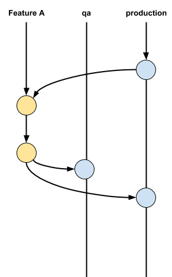

# learn-github-action

## Description

This repository is used to learn GitHub Actions. This repository app uses FastAPI which is a Python web framework and then dockerize it and push it to Docker Registry. [This](.github/workflows/python-app.yml) GitHub Action is used as CI to build and test FastAPI app. [This](.github/workflows/push-docker-dev.yml) GitHub Action is used as CI to build docker image in dev branch for non-production environment and push it to Docker Registry after pull request is merged to dev branch. [This](.github/workflows/push-docker-main.yml) GitHub Action is used as CI to build docker image in main branch for production environment and push it to Docker Registry after publish a release.

The CD flow uses Argo CD from [this](https://github.com/adadeeeh/eks/tree/main/argocd) repository

## Flow Development



1. Create repository secrets named **DOCKERHUB_USERNAME** and **DOCKERHUB_TOKEN**
2. Create **dev** branch from **main** branch for testing
3. Create **feature** branch from **main** branch for development
4. Once development is done, merge **feature** branch to **dev** branch using **pull request** to test it in non-production environment. An Action will run in this pull request.
5. Merged it and an Action will run to build Docker image for non-production environment
6. If it's running properly in non-production environment, adjust the code to suit the production environment, merge **feature** branch to **dev** branch using **pull request** and merge **feature** branch to **main** branch using **pull request**. Another Action will run in this pull request
7. Merged those 2 pull request and an Action will run to build Docker image for non-production environment and push it to Docker Registry
8. Create a tag in main branch. Example:

   ```
   git checkout main
   git tag -a v0.2.0 -m "Release version 0.2.0"
   git push origin v0.2.0
   ```

9. Publish a release using the tag that has been made before and Action will run to build Docker image for production environment and push it to Docker Registry

## Develop Locally

1. Create Python virtual environment

   ```
   python3 -m venv env
   ```

2. Activate virtual environment

   ```
   source env/bin/activate
   ```

   To deactivae virtual environment

   ```
   deactivate
   ```

3. Install requirements

   ```python
   pip3 install -r requirements.txt
   ```

4. Run FastAPI app

   ```
   uvicorn src.main:app --reload
   ```

   Or

   ```
   pyton3 src/main.py
   ```

5. Build Docker image

   ```
   docker build -t fastapi-cicd:1.0 .
   ```

6. Create and run container from Docker image

   ```
   docker run -d --name fastapi -p 80:8000 fastapi-cicd:1.0
   ```

   If container already exist, run container with

   ```
   docker start <container_name>
   ```

7. Acces the FastAPI container in **127.0.0.1:80**
